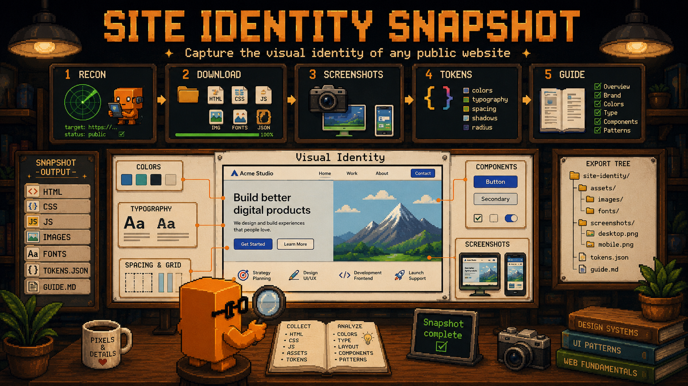

<div align="center">



# Site Identity Snapshot

**Captura a identidade visual completa de qualquer site público numa pasta de referência estruturada.**

HTML, CSS, JS, imagens, fontes, screenshots, design tokens em JSON e um guia visual narrativo — pronto pra alimentar rebrandings, análise competitiva ou extração de design system.

[](./LICENSE)
[](https://docs.claude.com/en/docs/claude-code/skills)
[](https://github.com/anthropics/claude-code/blob/main/docs/mcp.md)
[](#)

</div>

---

## ⚡ O que faz

Você tá começando um rebranding. Precisa entender — de verdade — a identidade visual do site atual (ou de um concorrente, ou de uma referência). Manda:

```
snapshot do site https://onprofit.com.br
```

E recebe, em uns minutos, uma pasta completa com **tudo o que define visualmente aquele site**:

> _"Capturei 1.7k linhas de HTML, 2.1k linhas de CSS, 47 imagens (organizadas por uso), 8 arquivos de fonte (Standerd + Figtree), 6 screenshots e extraí 47 cores nomeadas semanticamente, 9 níveis de tipografia, 8 keyframes, 4 padrões de animação. Guia humano em `analysis/visual-identity-guide.md` (233 linhas) e tokens estruturados em `analysis/design-tokens.json` (186 linhas), prontos pra Tailwind/Figma."_

Não é "scrape e pronto". É **scrape + análise estruturada + guia narrativo**, com tokens já agrupados por papel semântico.

## 📦 O que entra na pasta

```
<DEST>/
├── README.md                       ← documenta o snapshot
├── analysis/
│   ├── visual-identity-guide.md    ← guia humano (marca, paleta, type, anims, componentes, rebranding)
│   └── design-tokens.json          ← tokens estruturados (cores, type, radii, shadows, motion, breakpoints)
├── html/index.html
├── css/                            ← todos os .css linkados
├── js/                             ← scripts próprios apenas (sem GTM/Crisp/Analytics)
├── images/                         ← organizadas por uso (landing/, graphics/, icons/)
├── fonts/                          ← @font-face self-hosted, por família
└── screenshots/
    ├── desktop-fullpage.png        ← 1440px, página inteira
    ├── desktop-hero.png            ← 1440x900 viewport
    ├── mobile-fullpage.png         ← 390px, página inteira
    ├── mobile-hero.png             ← 390x844 viewport
    └── section-*.png               ← seções-chave (hero, footer, blocos distintivos)
```

## 🎯 Por que vale a pena

Captura de identidade visual costuma cair em dois extremos:

❌ **"Screenshot e copia o CSS"** — você fica com um amontoado de arquivos sem hierarquia, sem entender o que define a marca  
❌ **Ferramenta de extração de tokens automática** — cospe 200 cores sem distinguir `primary_accent` de `border_subtle_alpha`

**Aqui é diferente.** Cada artefato vem com:

- 🎨 **Tokens nomeados semanticamente** — `neon_green`, `deep_teal`, `text_muted` (não `color_47`)
- 📐 **Agrupados por papel** — primárias / escuras / neutras / bordas, não por valor hex
- 📖 **Guia narrativo** — explica *por que* a paleta é assim, *quando* usar cada token, *o que* define a personalidade visual da marca
- 🎬 **Animações categorizadas** — distingue CSS `@keyframes` de JS (`IntersectionObserver`, `requestAnimationFrame`)
- 🚀 **Cheat-sheet de rebranding** — direção acionável: o que preservar vs. o que conscientemente quebrar

## 🛠 Como funciona (5 fases)

| # | Fase | O que faz | Ferramenta |
|---|------|-----------|------------|
| 1 | **Recon** | Mapeia todos os assets (CSS, JS, imagens, fontes), classifica próprio vs. terceiro | Chrome DevTools MCP |
| 2 | **Download** | `curl` em todos os assets próprios, organizados por tipo e uso | `curl` |
| 3 | **Screenshots** | Desktop + mobile, full-page + viewport + seções-chave | Chrome DevTools MCP |
| 4 | **Token Extraction** | JS injetado via `evaluate_script` extrai computed styles, `@keyframes`, breakpoints do DOM vivo | Chrome DevTools MCP |
| 5 | **Documentation** | Gera `design-tokens.json`, `visual-identity-guide.md`, `README.md` | Write |

## 📊 Caso de uso real

Esta skill nasceu de um caso real: o rebranding do produto **manager-onprofit** (Core Studio). Antes de tocar uma linha do novo design, precisávamos congelar fielmente a identidade do site atual ([onprofit.com.br](https://onprofit.com.br)).

**O que a captura entregou em ~10 minutos:**

| Artefato | Tamanho |
|----------|---------|
| HTML clonado | 1.7k linhas |
| CSS clonado | 2.1k linhas (`landing.css`) |
| Imagens organizadas | 47 arquivos em `landing/`, `graphics/`, etc. |
| Fontes self-hosted | Standerd (5 pesos OTF) + Figtree (3 pesos woff2/woff) |
| Screenshots | 6 (desktop/mobile fullpage + hero + section-hero + section-footer) |
| `design-tokens.json` | 186 linhas, 47 cores semanticamente agrupadas |
| `visual-identity-guide.md` | 233 linhas, 11 seções narrativas |

**Achados que viraram decisões de rebrand:**

| Padrão capturado | Decisão informada |
|------------------|-------------------|
| Acento neon `#50FFB1` aparece em 11+ classes | "É a assinatura — trocar muda a marca inteira" |
| Pills (radius 3rem) em **todos** os botões | "Decidir explicitamente se mantém ou vai pra radius-md" |
| Standerd OTF + Lato Google Fonts + Figtree Bunny | "3 famílias é excesso, consolidar em 2 no rebrand" |
| Carrossel infinito (15s linear) em integrações | "Cadência de 0.6s nos fades é o 'movimento' da marca" |
| Layout 50/50 alternando bg branco/cinza | "Espinha dorsal — fácil de portar, só atenção aos mockups" |

Sem a skill, levaria 2-3 horas pra extrair manualmente. E provavelmente perderia metade dos detalhes.

## 🚀 Como instalar

### Opção 1 — Pessoal

```bash
git clone https://github.com/eduardodotai/site-identity-snapshot.git ~/.claude/skills/site-identity-snapshot
```

Reinicia o Claude Code (ou `/reload`). Pronto.

### Opção 2 — Time / projeto compartilhado

Adiciona como submódulo dentro do projeto:

```bash
cd seu-projeto
git submodule add https://github.com/eduardodotai/site-identity-snapshot.git .claude/skills/site-identity-snapshot
```

Quem rodar Claude Code dentro do repo já tem a skill automaticamente.

### Opção 3 — Download direto

Vai em [Releases](https://github.com/eduardodotai/site-identity-snapshot/releases), baixa o ZIP, extrai pra `~/.claude/skills/site-identity-snapshot/`.

## 📋 Requisitos

- [Claude Code](https://claude.ai/code) CLI ou extensão IDE
- [Chrome DevTools MCP](https://github.com/anthropics/claude-code/blob/main/docs/mcp.md) habilitado — **obrigatório** (screenshots + extração de tokens do DOM vivo)
- `curl` disponível no shell

## 🎮 Como usar

Depois de instalado, dentro do Claude Code:

```bash
# Captura básica — salva em reference/<dominio>/
snapshot do site https://example.com

# Em inglês
capture the visual identity of https://competitor.com

# Com destino customizado
extrair design tokens de https://startup.io para reference/inspiration/

# Outras triggers que funcionam
referência visual de https://brand.com para o rebranding
scraper de design de https://landing.page
clonar visual de https://site.com para reference
```

**Bônus:** a skill auto-dispara quando você menciona termos como _"snapshot do site"_, _"identidade visual de"_, _"extrair design tokens"_, _"referência visual"_, _"scraper de design"_. Não precisa decorar comando.

## 🧪 O que é capturado vs. ignorado

**Capturado:**
- HTML da página principal
- Todos os CSS linkados (incluindo @font-face stylesheets)
- JS próprio do site
- Imagens (organizadas por uso)
- Fontes self-hosted (`.woff2`, `.woff`, `.otf`, `.ttf`)
- Fontes de CDN (Google Fonts, Bunny Fonts, etc.)

**Ignorado** (referenciado apenas no README):
- Analytics & tags (GTM, GA4, Segment, Mixpanel)
- Chat widgets (Crisp, Intercom, Drift, Zendesk)
- A/B testing (Optimizely, VWO, Google Optimize)
- Players de vídeo (YouTube embeds, Vimeo, Wistia, Converte AI)
- Scripts de proteção Cloudflare
- Cookie consent (OneTrust, Cookiebot)

## 🎁 Edge cases já cobertos

- **SPAs (React/Vue/Angular)** — aguarda hidratação antes da extração
- **Cloudflare protection** — lida com email obfuscation e challenge pages
- **CSS Custom Properties** — extrai variáveis `:root` com valores resolvidos
- **Dark mode** — captura tema default, anota o toggle se existir
- **Renderização JS-heavy** — fallback pra `outerHTML` se o HTML estático vier vazio
- **Páginas muito longas** — section screenshots além do full-page

## 🤝 Contribuindo

Achou um site que a skill não capturou direito? Manda PR.

Os arquivos são markdown puro — nada de compilar, instalar dependência, configurar build. Edita, salva, abre PR.

Se você usar a skill em algum projeto e tiver feedback (cobertura de edge case, sugestão de campo novo no JSON), abre uma issue contando — ajuda a calibrar a próxima versão.

## 🔗 Skills relacionadas

Se você curtiu essa, dá uma olhada também em:

- 🎨 [**patterns-audit**](https://github.com/eduardodotai/patterns-audit) — Audit multi-agent de SOLID/DRY/GoF/code smells, score 0-100
- 📐 [**spec-driven-advanced**](https://github.com/eduardodotai/spec-driven-advanced) — Workflow SDD+RPI completo (Constitution → Research → Spec → Plan → Implement → Verify → Ship)
- 🎬 [**roteiros-virais**](https://github.com/eduardodotai/roteiros-virais) — Framework de roteiros virais PT-BR pra Reels/TikTok/Shorts

## 📜 Licença

[MIT](./LICENSE) — pode usar comercial, modificar, redistribuir. Só mantém o crédito.

## 🙏 Créditos

- **Anthropic Agent Skills standard**: [docs.claude.com](https://docs.claude.com/en/docs/claude-code/skills)
- **Chrome DevTools MCP**: integração que viabilizou a extração de tokens do DOM vivo
- **Empacotador**: [@eduardodotai](https://github.com/eduardodotai) — battle-tested no rebranding do [manager-onprofit](https://onprofit.com.br) (Core Studio)

---

<div align="center">

**Se essa skill economizar 2 horas do seu próximo rebranding, dá uma ⭐ no repo.**

[Reportar bug](https://github.com/eduardodotai/site-identity-snapshot/issues) · [Sugerir feature](https://github.com/eduardodotai/site-identity-snapshot/issues) · [Ver no GitHub](https://github.com/eduardodotai/site-identity-snapshot)

</div>
